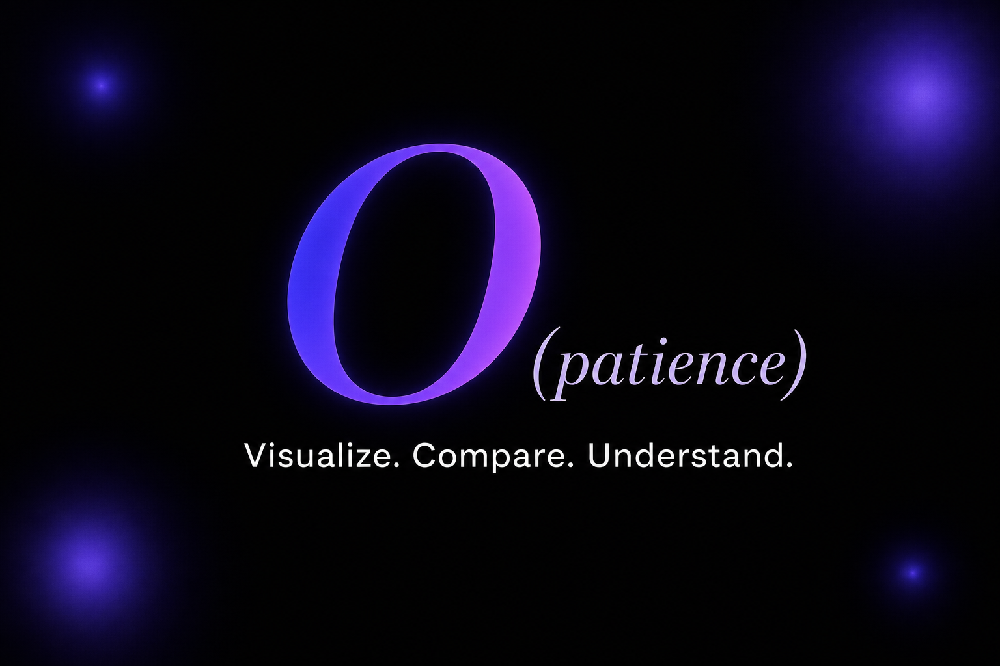

<div align="center">

# O(patience)

**Visualize. Compare. Understand.**

An interactive sorting algorithm playground for the curious mind — step through every compare, swap and write with live pointers, sound, and a tiered quiz.

[](https://sort-visually-abhirai2006.lovable.app)

<p>
  
  
  
  
  
</p>



</div>

---

## ✨ What is this?

Most sorting visualizers show you bars moving. **O(patience) shows you _why_ they move.**

Every step exposes the exact pointer positions (`i`, `j`, `min`, `low`, `mid`, `high`, `pivot`), the operation type (compare / swap / overwrite), and a live caption — so you're not just watching, you're reading the algorithm as it runs.

---

## 🔍 Visualizer

Five classic algorithms, fully instrumented:

| Algorithm | Best | Average | Worst | Space | Stable |
|-----------|------|---------|-------|-------|--------|
| Bubble Sort | O(n) | O(n²) | O(n²) | O(1) | ✅ |
| Selection Sort | O(n²) | O(n²) | O(n²) | O(1) | ❌ |
| Insertion Sort | O(n) | O(n²) | O(n²) | O(1) | ✅ |
| Merge Sort | O(n log n) | O(n log n) | O(n log n) | O(n) | ✅ |
| Quick Sort | O(n log n) | O(n log n) | O(n²) | O(log n) | ❌ |

**Controls & features:**
- 🎯 Live pointer flags float above their current index with color-coded chips
- 🎨 Bar states — unsorted (indigo) · comparing (cyan) · pivot (amber) · sorted (green)
- 💥 Squash-and-bounce swap animation
- 🔊 Sound mode — pitch mapped to bar value (220–880 Hz); swaps use square wave, compares use sine
- 🎉 Confetti on sort completion
- 📋 Scrollable step history with **JSON / CSV export**
- 🔢 Custom array input — comma or space separated, up to 100 values
- ⚠️ Duplicate-value detector with one-click fix
- 💥 Worst-case generator — pathological input for the active algorithm
- 🔗 Share link + `<iframe>` embed snippet
- Per-algorithm speed memory across tab switches

---

## 🏁 Compare / Race Mode

Same input, every algorithm, side by side.

- **Race** — all five run simultaneously; live 🥇🥈🥉 leaderboard ranked by remaining steps
- **Versus** — focused head-to-head between any two algorithms
- Animated rocket with "Race in progress" indicator while running
- Race history persisted in `localStorage` (last 10 runs) — click any to replay
- Export any race as JSON or CSV

---

## 🎯 Quiz Mode

Think you understand sorting? Prove it.

A scored, replayable game that goes from pattern recognition to deep algorithmic reasoning — across three escalating tiers.

```
┌──────────────────────────────────────────────────────────────┐
│  TIER 1 · 1pt each              Pattern Recognition          │
│  ──────────────────────────────────────────────────────────  │
│  Identify   Watch an unnamed animation. Name the algorithm.  │
│  Predict    See a mid-run state. Pick what happens next.     │
├──────────────────────────────────────────────────────────────┤
│  TIER 2 · 2pts each             Applied Understanding        │
│  ──────────────────────────────────────────────────────────  │
│  Trace      Given a step, pick the correct next state.       │
│  Bug        One pseudocode line is wrong. Find it.           │
├──────────────────────────────────────────────────────────────┤
│  TIER 3 · 3pts each             Deep Reasoning               │
│  ──────────────────────────────────────────────────────────  │
│  Reorder    Shuffled pseudocode lines. Put them in order.    │
│  Trade-off  Complexity, stability, real-world choices.       │
└──────────────────────────────────────────────────────────────┘
```

Every answer flips open an **explanation panel**. Score, streak, and best streak tracked throughout.

---

## 🧬 Sort DNA

A session personality engine built into the footer.

Every action you take is tracked — algorithm switches, steps advanced, pseudocode reads, races run, and how long you dwell on a single step. These are reduced to four scores (0–100):

| Score | What it measures |
|-------|-----------------|
| **Curiosity** | How much you explore algorithms and read pseudocode |
| **Speed** | How fast you move through steps (penalised for slow dwell) |
| **Breadth** | How many of the 5 algorithms you've visited |
| **Race** | How much you use race/versus mode |

Your personality is derived from the combination:

> Explorer · Deep Diver · Speedrunner · Loyalist · Completionist · Chaotic One

Animated score bars fill on first render. Share your DNA as a text summary or reset the session.

---

## 📦 Embeddable Widget

A chrome-free version of the visualizer lives at `/embed` — built to be dropped into blog posts and teaching pages:

```html
<iframe
  src="https://sort-visually-abhirai2006.lovable.app/embed"
  width="100%"
  height="600"
  frameborder="0"
/>
```

The **Embed** button inside the visualizer copies the ready-to-paste snippet automatically.

---

## ⌨️ Keyboard Shortcuts

| Key | Action |
|-----|--------|
| `Space` | Play / Pause |
| `←` | Step backward |
| `→` | Step forward |
| `R` | Reset |

---

## 🛠 Tech Stack

| | |
|--|--|
| **Framework** | TanStack Start v1 — React 19, SSR-aware, file-based routing |
| **Build** | Vite 7 |
| **Styling** | Tailwind CSS v4 — `@import "tailwindcss"` + OKLCH design tokens, no config file |
| **Data** | TanStack Query |
| **Deployment** | Cloudflare Workers (edge SSR) |
| **Icons** | lucide-react |
| **Fonts** | Playfair Display · Inter · JetBrains Mono · Caveat |
| **UI primitives** | shadcn/ui |

All sorting logic is **pure TypeScript** in `src/lib/algorithms.ts` — no dependencies, no side effects. Each algorithm returns a typed `Step[]` stream that the visualizer replays frame-by-frame.

---

## 📁 Project Structure

```
src/
├── routes/
│   ├── __root.tsx        # Global shell, head tags, JSON-LD structured data
│   ├── index.tsx         # Splash → Loader → Visualizer + Compare
│   ├── quiz.tsx          # Tiered quiz game (544 lines, fully self-contained)
│   └── embed.tsx         # Chrome-free iframe widget
│
├── components/
│   ├── Visualizer.tsx    # Core step-by-step visualizer (850 lines)
│   ├── Compare.tsx       # Race & Versus mode (534 lines)
│   ├── Footer.tsx        # Sort DNA personality engine
│   ├── SplashScreen.tsx  # Full-screen entry with starfield + aurora
│   ├── SortingLoader.tsx # 1.5s bubble-sort hourglass bridge animation
│   ├── Confetti.tsx      # Burst on sort completion
│   ├── CursorGlow.tsx    # Radial glow that follows the cursor
│   ├── Signature.tsx     # Author signature (fade-in on hover)
│   ├── Tilt.tsx          # 3D tilt on hover utility
│   ├── RocketLoader.tsx  # Animated rocket for race mode
│   └── ui/               # shadcn/ui primitives
│
├── lib/
│   ├── algorithms.ts     # All 5 sorting step generators + metadata + pseudocode
│   ├── dna-tracker.ts    # Session behaviour scoring + personality derivation
│   └── utils.ts
│
└── hooks/
    ├── use-reveal.ts     # Intersection Observer scroll-reveal hook
    └── use-mobile.tsx    # Viewport breakpoint hook

public/
├── og-image.png          # 1200×630 social preview card
├── robots.txt            # Crawler rules
├── sitemap.xml           # Route map for search engines
├── llms.txt              # AI assistant summary
└── favicon.*             # Full favicon set (ico, png, apple-touch, manifest)
```

---

## 👤 Built by

**Abhishek Rai A** [**(Abhirai2006)**](https://github.com/Abhirai2006)
